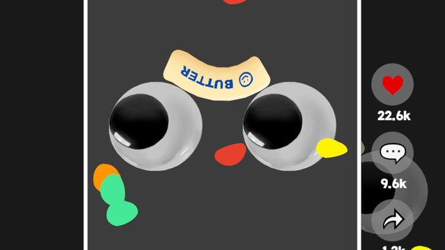
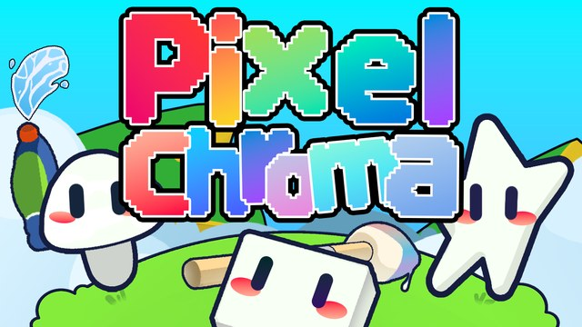
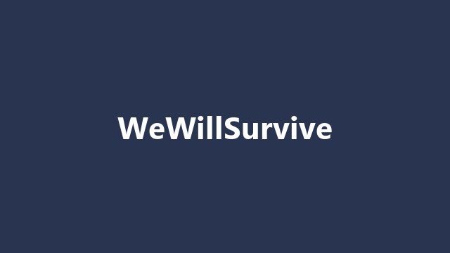

  

## About Me

### **현장 납품부터 출시까지**, **결과로 증명**해 온 개발자입니다.

- **Email** · [sjh960612@naver.com](mailto:sjh960612@naver.com)
- **Portfolio** · [junghun-portfolio-rouge.vercel.app](https://junghun-portfolio-rouge.vercel.app/)

## Featured Projects

<table>
  <tr>
    <td align="center" valign="top" width="33%">
      
      <h3>ButterPop!</h3>
      
버터 스퀴시를 올려쳐 안착시키는 캐주얼 모바일 게임

      <b>개발 전담 · 출시 gamescom asia 2026 전시</b>
    </td>
    <td align="center" valign="top" width="33%">
      
      <h3>Pixel Chroma</h3>
      
몸을 색칠해 숨는 2D 픽셀 숨바꼭질 멀티플레이

      <b>4인 팀 팀장 Steam 출시</b>
    </td>
    <td align="center" valign="top" width="33%">
      
      <h3>WeWillSurvive</h3>
      
우주에서 조난당해 버티는 PC 생존 게임

      <b>2025 서울게임타운 전시</b>
    </td>
  </tr>
</table>

## Tech Stack

  
  
  
  
  
  
  

## Career

| 기간 | 소속 | 내용 |
| :--- | :--- | :--- |
| 2025.03&nbsp;~&nbsp;현재 | 61315 GAMELAB | 인디게임 동아리 · 기획·아트와 협업해 게임 출시·전시 |
| 2024.01&nbsp;~&nbsp;2025.10 | 더프레임워크 | Unity 기반 전시·체험 콘텐츠 개발 전담 |
| 2021.07&nbsp;~&nbsp;2021.12 | 솔탑 운용시스템개발팀 | 인턴 · C#·WPF 프로그램 개발 (MVC·MVVM) |
